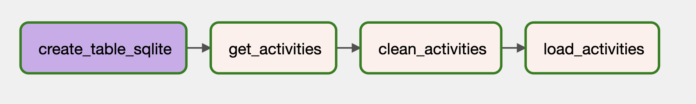

# CREATING A DATA PIPELINE TO EXTRACT STRAVA RUN DATA USING APACHE AIRFLOW

## What is Strava?
Strava is an application that you can download on mobile devices and smart watches to track your physical activity. Strava is able to track numerous activities such as running, biking, swimming, walking, skiing and much more. 

## Purpose of this project 
As an avid runner, I have been tracking my runs on Strava for just over 3 years now. I came up with this project idea on one of my runs, thinking it would be fascinating to extract my data from Strava and store it on a database. Utilizing this database, I could then analyze my runs and come up with cool insights. 

## Using Apache Airflow to create the pipeline
I used Apache Airflow to create a data pipeline to extract my acitivities from strava daily and store them on a local database. 

Please refer to the following python script where I implemented the Airflow pipeline:
 https://github.com/ruhimahendra24/Strava_pipeline/blob/master/AIRFLOW/dags/strava_pipeline.py

 I followed to following Youtube tutorial to help develop this pipeline: 
 https://www.youtube.com/watch?v=s-r2gEr7YW4&t=2s&ab_channel=Dataquest

### The pipeline has the following steps: 

### 1. Extracting Data using the Strava API: 
To extract data using Strava's API I followed the tutorial from this medium article: 
https://medium.com/swlh/using-python-to-connect-to-stravas-api-and-analyse-your-activities-dummies-guide-5f49727aac86

I was able to create a final dataframe containing all my strava activities with the following fields: 

| id         | name          | start_date_local     | type | distance | moving_time | elapsed_time | total_elevation_gain | end_latlng                              | external_id              |
|------------|---------------|----------------------|------|----------|-------------|--------------|----------------------|-----------------------------------------|--------------------------|
| 8606661694 | Afternoon Run | 2023-02-22T17:02:38Z | Run  | 10016.3  | 3490        | 3490         | 0                    | []                                      | garmin_ping_261329294432 |
| 8599235269 | Lunch Run     | 2023-02-21T11:20:15Z | Run  | 5022.2   | 1763        | 1801         | 0                    | []                                      | garmin_ping_261131602348 |
| 8590113211 | Afternoon Run | 2023-02-19T16:34:39Z | Run  | 4011.2   | 1502        | 1597         | 16.7                 | [45.51873310469091, -73.56943625025451] | garmin_ping_260857840571 |
| 8577118622 | Lunch Run     | 2023-02-17T11:40:57Z | Run  | 9378.5   | 3270        | 3314         | 0                    | []                                      | garmin_ping_260520550140 |
| 8573331541 | Afternoon Run | 2023-02-16T16:51:51Z | Run  | 23.8     | 11          | 11           | 0                    | []                                      | garmin_ping_260402556613 |
| 8474252665 | Evening Run   | 2023-01-29T18:09:14Z | Run  | 2087.9   | 753         | 753          | 0                    | []                                      | garmin_ping_257662961670 |
| 8467968905 | Afternoon Run | 2023-01-28T16:21:30Z | Run  | 8002.3   | 2760        | 2760         | 0                    | []                                      | garmin_ping_257502212384 |

### 2. Creating the Relational Database:

The second step in this DAG is to create the table that I want to start in the local database using the `SqliteOperator` on Python. 

Here is the SQL operation I wrote to create the table to store my runs: 

    CREATE TABLE IF NOT EXISTS runs (
                'id' TEXT PRIMARY KEY,
                'name' TEXT,
                'start_date_local' TEXT,
                'type' TEXT,
                'distance' TEXT,
                'moving_time' TEXT,
                'elapsed_time' TEXT,
                'total_elevation_gain' TEXT,
                'end_latlng' TEXT,
                'external_id' TEXT)

### 3. Cleaning up the data:

Because I just want to focus on analyzing run data, this step of the pipeline filters out activities that are not of 'type' == 'Run'.

### 4. Loading the Database:

The last step in this pipeline is to load the table called 'runs' with the run data extracted from strava. 

This is what the final DAG looks like: 

